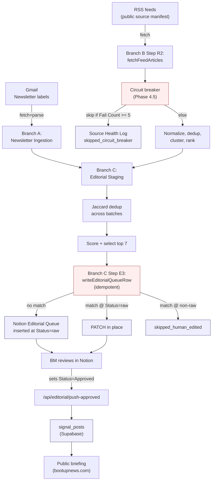
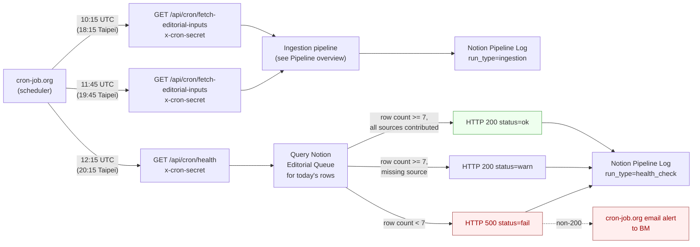

# Architecture — Boot Up Ingestion Pipeline

The Boot Up ingestion pipeline collects newsletter and RSS source inputs, deduplicates and ranks them into a small set of Signal candidates, and writes them to a Notion Editorial Queue where the editor (BM) reviews and approves. Approved rows are then promoted to Supabase for publication on the public briefing surface. Triggering moved off Vercel Hobby Cron to external cron-job.org in [PRD-65](product/prd/prd-65-pipeline-reliability-external-cron-migration.md); idempotency, health checks, and a circuit breaker make the pipeline safe to retry and easy to observe.

## Pipeline overview

Reading the diagram:

- **Branch A** (Gmail newsletter ingestion) and **Branch B** (RSS) feed candidates into **Branch C** (Editorial Staging).
- **Branch B Step R2** consults the [RSS circuit breaker](../src/lib/observability/rss-circuit-breaker.ts) before each fetch. A source with `Fail Count >= 5` for the day is skipped; the skip is recorded in the Source Health Log and **does not** report to Sentry.
- **Branch C Step E3** is idempotent. Every write to the Notion Editorial Queue is one of `inserted`, `updated`, or `skipped_human_edited`. Two consecutive runs with the same source set produce zero duplicates; rows the editor has already touched (`Status != raw`) are never modified.
- After human review, approved rows are promoted to `signal_posts` in Supabase via [`/api/editorial/push-approved`](../src/app/api/editorial/push-approved/route.ts). That promotion path is unchanged by PRD-65 and lives outside the cron lane.

Detailed contracts:

- Editorial Staging steps B–G and the idempotency contract: [`docs/engineering/protocols/editorial-automation-operating-guide.md`](engineering/protocols/editorial-automation-operating-guide.md).
- Notion Editorial Queue schema: managed in the live Notion database; see the editorial automation guide for the field reference.
- Pipeline Log schema (per-run operational record): [`docs/notion-pipeline-log-schema.md`](notion-pipeline-log-schema.md).
- Source Health Log schema (per-source-per-day fetch outcomes): [`docs/notion-source-health-schema.md`](notion-source-health-schema.md).

## External triggering

| UTC | Taipei | Job | Purpose |
| --- | --- | --- | --- |
| 10:15 | 18:15 | `bootup-ingestion-1015-utc` | First ingestion run (early evening, gives time for re-runs before editor review) |
| 11:45 | 19:45 | `bootup-ingestion-1145-utc` | Second ingestion run (catches any sources slow to publish in the first window) |
| 12:15 | 20:15 | `bootup-health-check-1215-utc` | Health check 30 minutes after the second ingestion run; HTTP 500 triggers an email alert |

Source-of-truth for the schedule is [`scripts/cron-jobs.config.ts`](../scripts/cron-jobs.config.ts). Apply changes with `npm run cron:sync` (see [`docs/CRON_SETUP.md`](CRON_SETUP.md)).

## Auth and rollback

- Both `/api/cron/fetch-editorial-inputs` and `/api/cron/health` authenticate by checking the `x-cron-secret` HTTP header against `process.env.CRON_SECRET`. Missing or mismatched header → HTTP 401, no pipeline work happens.
- The legacy Vercel Cron `Authorization: Bearer <CRON_SECRET>` header is honored only when `ALLOW_VERCEL_CRON_FALLBACK=true`. This is the rollback escape hatch for re-enabling Vercel Cron during a cron-job.org outage; see [`docs/CRON_SETUP.md`](CRON_SETUP.md#5-rollback).
- The `crons` array is intentionally absent from `vercel.json`. Do not re-add it without flipping the fallback flag.

## What's outside this initiative

PRD-65 does not change:

- Branch A's newsletter parsing, label preflight, or write gates.
- Branch B's normalization, deduplication, clustering, or ranking logic. Only the fetch step (R2) is touched, and only to consult the circuit breaker and record per-source outcomes.
- The Supabase push path (`/api/editorial/push-approved` and downstream `signal_posts` reads).
- Any public surface, ranking signal, or editorial UI.

For the broader product, see the [README](../README.md) and the PRD index under [`docs/product/prd/`](product/prd/).
